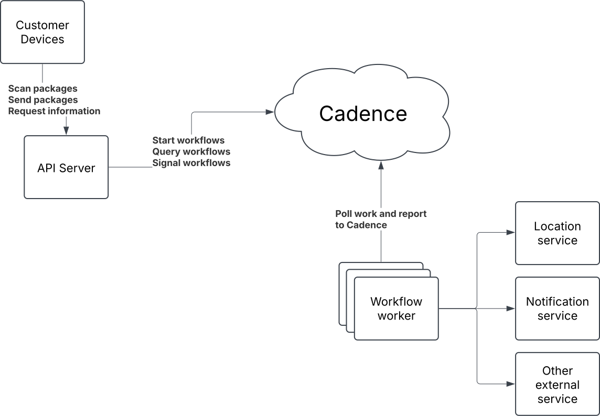

# Introduction

We are going to build the backend for a postal delivery management system.

The system will support the following
- Tracking the package across locations. The package will be scanned when it arrives at a new location
- Informing the customer when the package is close to delivery
- Letting the customer get the current location of their package
- Scale to hundreds of millions of packages

The architecture of the system is shown below:



We see that customers will communicate with cadence via the API server. The workflow workers will then do the work assigned to them by Cadence and interact with other services.

We will focus on building the workflow worker. We will mock service calls and just use hardcoded data. In place of the API server we will use the Cadence CLI to call Cadence directly.

# First steps

This repository contains
1. A docker compose file which lets you start Cadence
2. A cadence worker.

You will need three terminals to run the code in this repository.
1. One for running the Cadence server via Docker Compose.
2. One for running the Cadence CLI.
3. One for running the Cadence worker contained in this repository.

## Running the Cadence server

In one terminal, run the following command from the repository root:
```bash
docker-compose up
```

You will see a lot of output as the Cadence server starts up.
The cadence web UI will be available at http://localhost:8088.

## Running the Cadence CLI

Every time we will interact with Cadence, we're going to use cadence-cli.
For this, you simply run `./cadence` command from the repository root.

### Creating a domain for the worker
Before we can start the worker, we need to create a domain for it.
Run the following command in a terminal:
```bash
./cadence --domain cadence-workshop domain register
```

You should now be able to see the domain in the Cadence web UI here:
http://localhost:8088/domains/cadence-workshop

## Running the Cadence worker
To run the cadence worker, simply run the following from the repository root:
```bash
go run main.go
```

## Starting a workflow
We now have a worker running, we will use the Cadence CLI to start a workflow that is already defined on the worker:

To start the hello world workflow, run the following command:
```bash
./cadence --domain cadence-workshop wf start --tasklist tasklist --execution_timeout 10 --workflow_type HelloWorld --input '{"message":"Cadence"}'
```

The workflow should start, and you should see the workflow in the web UI:
http://localhost:8088/domains/cadence-workshop

We are now ready to start building our service.

# Building the service
Each package will be handled using the package_processing workflow. A small part of this is already implemented in the `workflow/shipping/package_processing.go` file.
If you get stuck or just want to see how we did it, you can always look at the `workflow/shippingcompleate/package_processing.go` file which has the whole workflow implemented.

## Implementing the first activities.
Lets implement the `validatePayment()` and `shipProduct()` activities for the OrderProcessingWorkflow.

The `validatePayment()` activity should check if the order amount is greater than 25 and return an error if it is, otherwise return true for valid payments.

The `shipProduct()` activity should verify that the `order.Customer` (representing the shipping address) is not empty;
if it is, return an error indicating that shipping failed, otherwise simulate shipping and return true for successful shipment.

> [!NOTE]
> Remember to *register* the `shipProduct` activity the same way the `validatePayment` activity is registered in the top of the workflow.

After this is implemented we can simulate a package getting send, and manually start the workflow using the following command:
```bash
./cadence --domain cadence-workshop wf start --tasklist tasklist --execution_timeout 10 --workflow_type OrderProcessingWorkflow --input '{"id":"Order123", "customer": "Cadence", "amount": 20, "address": "Uber office", "sendFrom": "Aarhus"}'
```

> [!NOTE]
> In a real system we would probably set the workflowID to be the order ID, so our start command would be:
> ```bash
> ./cadence --domain cadence-workshop wf start --tasklist tasklist --execution_timeout 10 --workflow_type OrderProcessingWorkflow --workflow_id Order123 --input '{"id":"Order123", "customer": "Cadence", "amount": 20, "address": "Uber office", "sendFrom": "Aarhus"}'
> ```
> This allows us to signal and query the workflow responsible for the package. However for now we will not specify it. This means Cadence will choose a UUID for us as the workflow ID. This allows us to start the workflow as many times we want.

## Failures and Retries
Lets modify the validatePayment to simulate a failure. This can be done by causing the activity to fail intermittently, e.g. by returning an error for the first few attempts, which will simulate a temporary issue like a network failure.

We use the code below to simulate the failure. The `info.Attempt` value from the `activity.GetInfo(ctx)` function tracks the current attempt count.
```go
func validatePayment(ctx context.Context, order Order) (string, error) {
	// Simulate a failure if this is the 0th or 1st attempt
	info := activity.GetInfo(ctx)
	if info.Attempt < 2 {
		activity.GetLogger(ctx).Info("Temporary failure in payment processing")
		return "", fmt.Errorf("temporary issue, please retry")
	}

	activity.GetLogger(ctx).Info("Payment processed successfully")
	return "Payment successful", nil
}
```

If we run the workflow now we will see that it fails in the first runs and returns an error.

### Adding a Retry Policy
Now, we can add a retry policy to handle the temporary failures. The validatePayment should retry up to 3 times with exponential backoff.

> [!NOTE]
> Read more about the activity and workflow retries: https://cadenceworkflow.io/docs/go-client/retries/

We can use the paymentRetryPolicy configuration below:
```go
// Retry policy configuration: exponential backoff with a maximum of 3 retries.
var paymentRetryPolicy = &cadence.RetryPolicy{
	InitialInterval:    1 * time.Second,    // Start with 1 second.
	BackoffCoefficient: 2.0,                // Exponential backoff.
	MaximumInterval:    10 * time.Second,   // Max retry interval.
	MaximumAttempts:    3,                  // Retry up to 3 times.
}
```
We can then specify the policy in the activity options when starting the activity like this:
```go
// Configure activity options with retry policy.
	// Configure activity options with retry policy, along with mandatory timeouts.
var activityOptions = workflow.ActivityOptions{
	RetryPolicy:            paymentRetryPolicy, // Attach retry policy.
	ScheduleToStartTimeout: time.Minute,
	StartToCloseTimeout:    time.Minute,
}

// Add the activity options to the context.
activityCtx = workflow.WithActivityOptions(ctx, activityOptions)

// Start the activity
workflow.ExecuteActivity(activityCtx, activities.validatePayment)
```
> [!TIP]
> - `workflow.ActivityOptions{}` is a struct that takes the options for the activity execution.
> - `workflow.WithActivityOptions(ctx, activityOptions)`: This function adds the given activity options (such as the retry policy) to the workflow context (ctx).

We can now execute the workflow and verify the `validatePayment()` activity is retried.

## Tracking the location of the package

We will track the location of the package in the workflow using a list of location names, lets declare a list of location names, and add the initial sendFrom location to the list:

```go
locations := []string{order.SendFrom}
```

## Adding a signal
We then add a signal handler, such that we can send signals to the workflow. First we add a signal value struct for the `scan` signal.

```go
type ScanSignalValue struct {
	Location string `json:"location"`
}
```

We then create a signal channel, with a signal name:

```go
signalChan := workflow.GetSignalChannel(ctx, "ScanSignal")
```

We now have the signal channel, we can then create a selector and add the `signalChan` together with a callback function. In the callback function we add the location from the signal to the location list.

```go
s := workflow.NewSelector(ctx)
s.AddReceive(signalChan, func(c workflow.Channel, more bool) {
	var signalVal ScanSignalValue
    c.Receive(ctx, &signalVal)
    workflow.GetLogger(ctx).Info("Received signal!", zap.Any("signal", "ScanSignal"), zap.String("value", signalVal))
	locations = append(locations, signalVal.Location)
})
```

Not that we do not guard the locations slice with a mutex, as Cadence guarantees only one signal is received at the time. We then just need to wait on the signal

```go
s.Select(ctx)
```

We can now start the workflow using the command below. Note that we manually give the workflow id as `"Order1232"`, this is so we can refer to the workflow when sending the signal. We also set the execution timeout to 600 so we have time to send the signal:
```bash
./cadence --domain cadence-workshop wf start --tasklist tasklist --execution_timeout 600 --workflow_type OrderProcessingWorkflow --workflow_id Order123 --input '{"id":"Order123", "customer": "Cadence", "amount": 20, "address": "Uber office", "sendFrom": "Aarhus"}'
```

We can now see in the UI that the workflow is waiting for the signal

We then send a signal to the workflow using the command:

```bash
./cadence --domain cadence-workshop wf signal --name "ScanSignal" --workflow_id Order123 --input '{"location":"delft"}'
```

Note that after the workflow was signaled it just stops, we need to create a loop around the select:

```go
for {
	s.Select(ctx)
}
```

We can now start a workflow and signal it as much as we want, however, since the loop is infinite we will never terminate the workflow.

### Adding a `delivered` signal
We will add a signal to the workflow to signal that the package has been delivered, and the workflow should terminate.
First we add a `packageDelivered` variable in the beginning of the workflow, next to the `locations` variable:
```go
packageDelivered := false
```

We can then add the new signal channel, this should be done *before* the for loop.
```go
deliveredChan := workflow.GetSignalChannel(ctx, "DeliveredSignal")
```

We then add the channel to the selector with the action we want it to do:
```go
s.AddReceive(deliveredChan, func(c workflow.Channel, more bool) {
	packageDelivered = true
})
```

When we get the signal we do not even read the input we just set `packageDelivered` to true, we can then change the loop to:
```go
for !packageDelivered {
	s.Select(ctx)
}
```

We can now signal the workflow as much as we want, and in the end send the delivered signal like this:

```bash
./cadence --domain cadence-workshop wf signal --name "DeliveredSignal" --workflow_id Order123
```

## Querying the workflow for the status of the package
We do not want customers to look at the status of their delivery in the Cadence UI, so we would like to query the workflow for the current status of the delivery, we can do this using a Cadence query handler.

The query handler will be defined right below the definitions of the `locations` and `packageDelivered` variables, as we need the query handler code to run there.

First we define the query result struct:
```go
type QueryResult struct {
	Delivered bool `json:"delivered"`
	LocationHistory []string `json:"locationHistory"`
}
```

We can then add the query handler:
```go
err := workflow.SetQueryHandler(ctx, "current_status", func() (QueryResult, error) {
	return QueryResult{
		Delivered:       packageDelivered,
		LocationHistory: locations,
	}, nil
})
if err != nil {
	return "", fmt.Errorf("set query handler: %v", err)
}
```

Now we can query the running workflow using the CLI:
```bash
./cadence --domain cadence-workshop wf query --query_type current_status --workflow_id Order123
```

We can also run the query from the cadence UI on the Queries tab.

## Notification timer
We want to notify the customer where there is 1 day until the package will arrive. We can calculate this time using the current location and the package order. We will simulate the calculation and just choose a random number between 1 and 7 in this tutorial. Lets add the function, we will call this function as an activity, so we also have to register it in the top of the workflow.

```go
func estimatedDeliveryTime(ctx context.Context, order Order, currentLocation string) (int, error) {
	return rand.IntN(3) + 1, nil
}
```

###  Changing the workflow code
We want the following, when a new scan signal comes in we want to update the timer, as we have new information about the location of the package. If the notification has been sent once, we do not send it ever again.

Right after we create the selector we create two variables, `notificationSent` and `timerCancel`. `notificationSent` keeps track of if we have ever sent the notification to the user, if so we should not resend it. `timerCancel` is a handle we can use to cancel the current timer waiting to notify the user. We create the two new variables like this:

```go
s := workflow.NewSelector(ctx) // existing line
notificationSent := false
timerCancel, err := updateTimeout(ctx, s, nil, &notificationSent, order, locations)
if err != nil {
	return "", fmt.Errorf("update timeout: %v", err)
}
```

We have not yet written the `updateTimeout` function.

We then need to trigger the `updateTimeout` every time we get a scan signal. We add the call in the signal handler function, right after we append to the locations slice. We simply call the `updateTimeout` function:

```go
locations = append(locations, signalVal.Location) // existing line
timerCancel, err = updateTimeout(ctx, s, timerCancel, &notificationSent, order, locations)
if err != nil {
	workflow.GetLogger(ctx).Error("Error updating timeout", zap.Error(err))
}
```

### The update timeout function
Then we just need to write the updateTimeout function, it's listed here in it's entirety:
```go
func updateTimeout(ctx workflow.Context, s workflow.Selector, timerCancel workflow.CancelFunc, notificationSent *bool, order Order, locations []string) (workflow.CancelFunc, error) {
	// Cancel the previous timer if it exists
	if timerCancel != nil {
		timerCancel()
	}

	// If the notification has already been sent, do not create a new timer
	if *notificationSent {
		return nil, nil
	}

	// Get the delivery estimate
	var daysToDelivery int
	err := workflow.ExecuteActivity(ctx, estimatedDeliveryTime, order, locations[len(locations)-1]).Get(ctx, &daysToDelivery)
	if err != nil {
		return nil, fmt.Errorf("estimated delivery time: %v", err)
	}

	// Create a new timer context and cancel function
	var timerCtx workflow.Context
	timerCtx, timerCancel = workflow.WithCancel(ctx)

	// Create a new timer with the new context, we use minutes instead of days
	timer := workflow.NewTimer(timerCtx, time.Duration(daysToDelivery)*time.Minute)

	// Add the new timer to the selector
	s.AddFuture(timer, func(f workflow.Future) {
		handleTimeout(ctx, f, notificationSent)
	})
	return timerCancel, nil
}
```

Note that the `updateTimeout` function calls the `handleTimeout` function which is discussed below. The `updateTimeout` progresses in the following steps:

1. Check if the timerCancel handle has a timer, if it does we cancel the old timer so we never have more than one notification timer.
2. Check if the notification has already been sent, if so we just return.
3. Call the activity we created above which estimates how many days there are until the delivery.
4. Create a new context with timeout so we can cancel the timer (this `timerCancel` is the new handle that will be canceled in step 1.).
5. create the new timer
6. Add the timer to the selector with `handleTimeout` as the handler function.

So to sum up, we cancel any old timer, do some checks, then we create the new timer, and add it to the selector.

### The handle timeout function
The handler function is listed below:

```go
func handleTimeout(ctx workflow.Context, f workflow.Future, notificationSent *bool) {
	err := f.Get(ctx, nil)
	// If the timer was canceled, ignore the event
	var canceledErr *cadence.CanceledError
	if errors.As(err, &canceledErr) {
		return
	}

	// If there was an error, log it and return
	if err != nil {
		workflow.GetLogger(ctx).Error("Error updating timeout", zap.Error(err))
		return
	}

	// The notification was sent, set the flag to true
	*notificationSent = true

	// We should call a notification activity here - but we just log it for now
	workflow.GetLogger(ctx).Info("Notification sent")
}
```

This function also looks a bit more complicated than it is. The function does the following:

1. Get the future, we just do this to see any errors. A canceled timers future will be available immediately and will return a `CanceledError`, so we need to check for this.
2. If the timer was canceled, we just ignore this event and return.
3. If some other error happened with the timer we log the issue and stop the handling.
4. Otherwise we note that we have sent the notification, and, for now, just log that we have sent the notification.


# Final Thoughts
Congratulations you have now build a *scaleable* track and trace backend in only ~250 lines of code, the system has retries, it can track hundreds of millions of packages. It can also track timers for all the packages and inform customers when their package is close to delivery.

As a final exercise consider how you would have build this without Cadence, how would you handle millions of concurrent timers needed to fire at the right time. How would you handle hundreds of millions of scans across the days. How would you handle sharding, how would you make sure customers were not notified after delivery etc.
